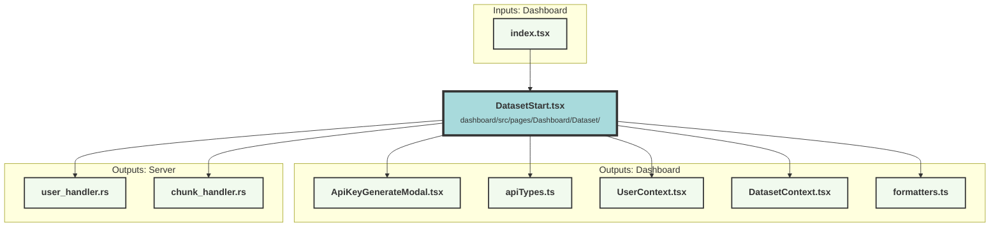

# DatasetStart.tsx


    classDef mainNode fill:#f9f,stroke:#333,stroke-width:4px;
classDef otherNode fill:#ccf,stroke:#333,stroke-width:2px;
3153979318["<b>DatasetStart.tsx</b><br/><small>dashboard/src/pages/Dashboard/Dataset/</small>"]:::mainNode
subgraph "Inputs: Dashboard"
    823481955["<b>index.tsx</b>"]:::otherNode
end;
823481955 --> 3153979318;
subgraph "Outputs: Dashboard"
    1088935568["<b>apiTypes.ts</b>"]:::otherNode;
    1137686434["<b>UserContext.tsx</b>"]:::otherNode;
    2613122857["<b>DatasetContext.tsx</b>"]:::otherNode;
    730599621["<b>ApiKeyGenerateModal.tsx</b>"]:::otherNode;
    3300477352["<b>formatters.ts</b>"]:::otherNode;
end;
    3153979318 --> 1088935568;
    3153979318 --> 1137686434;
    3153979318 --> 2613122857;
    3153979318 --> 730599621;
    3153979318 --> 3300477352;
subgraph "Outputs: Server"
    3745647460["<b>chunk_handler.rs</b>"]:::otherNode;
    953673172["<b>user_handler.rs</b>"]:::otherNode;
end;
    3153979318 --> 3745647460;
    3153979318 --> 953673172;

```
### Purpose
The `DatasetStart` component is designed to provide users with an interface to manage their datasets and API keys. It allows users to view and copy dataset and organization IDs, manage API keys, and access initial request examples for adding searchable data and starting searches.

### Flow
1. **Imports and Contexts**: The component imports necessary functions and components from various libraries and contexts, such as `solid-js`, `UserContext`, and `DatasetContext`.

2. **State Management**: 
   - `apiKeys` and `openModal` signals are created to manage the state of API keys and the modal visibility.
   - `selectedOrganization`, `curDataset`, and `currentUserRole` memos are created to derive the current organization, dataset, and user role from the context.

3. **API Key Management**:
   - `getApiKeys` function fetches the API keys from the server.
   - `deleteApiKey` function deletes a specific API key and refreshes the list.

4. **Effects**:
   - `createEffect` hooks are used to fetch API keys when the component mounts and when the modal state changes. Cleanup functions are provided to abort fetch requests if necessary.

5. **Rendering**:
   - The component renders a main section with information about the dataset and organization, including buttons to copy their IDs.
   - It displays a list of API keys with options to delete them.
   - It includes buttons and modals for creating new API keys.
   - It provides sections with initial request examples for adding searchable data and starting searches, including links to detailed API documentation.

6. **Modal**: The `ApiKeyGenerateModal` component is used to handle the creation of new API keys.

##### Auto generated documentation file from CodeViz.ai
