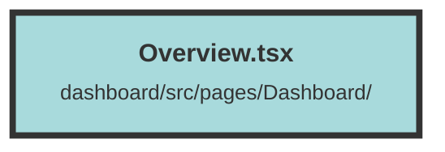

# Overview.tsx

### Purpose
The `Overview` component provides a comprehensive view of the user's organization, including datasets, usage statistics, and subscription plans. It serves as a dashboard for users to manage and monitor their organization's data and usage.

### Flow
1. **Imports and Context Setup**:
   - Imports necessary hooks and components from `solid-js` and other modules.
   - Retrieves the `UserContext` to access user-specific data.

2. **State Initialization**:
   - Initializes signals to manage datasets, organization subscription plans, usage statistics, and modal visibility.

3. **Selected Organization Memo**:
   - Uses `createMemo` to derive the selected organization based on the user's context.

4. **Data Fetching with `createEffect`**:
   - Fetches datasets, subscription plans, and usage statistics for the selected organization.
   - Handles errors and displays appropriate messages using `createToast`.
   - Cleans up fetch requests on component unmount using `onCleanup`.

5. **Rendering**:
   - Displays organization details and provides links to API documentation and community channels.
   - Shows organization ID with a copy-to-clipboard feature.
   - Renders `OrganizationUsageOverview` and `DatasetOverview` components to display usage statistics and datasets.
   - Includes a modal (`NewDatasetModal`) for creating new datasets.

##### Auto generated documentation file from CodeViz.ai
