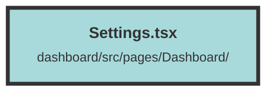

# Settings.tsx

### Purpose
This file defines the settings page for an organization within a web application. It includes forms for updating organization details and deleting the organization, providing a user interface for managing organization settings.

### Flow
1. **OrgSettingsForm Component**:
   - **Initialization**: Imports necessary Solid.js functions and context, and initializes state signals for organization name and updating status.
   - **Selected Organization**: Uses `createMemo` to get the currently selected organization from the user context.
   - **Effect**: Updates the organization name input field when the selected organization changes.
   - **Update Function**: Sends a PUT request to update the organization name on the server and updates the user context with the new organization name.
   - **Form**: Renders a form with an input field for the organization name and a submit button that triggers the update function.

2. **OrgDangerZoneForm Component**:
   - **Initialization**: Imports necessary Solid.js functions, context, and navigation hooks, and initializes state signals for deleting status.
   - **Selected Organization**: Uses `createMemo` to get the currently selected organization from the user context.
   - **Delete Function**: Confirms the deletion, sends a DELETE request to the server, updates the user context, navigates to the appropriate page, and shows a toast notification based on the result.
   - **Form**: Renders a form with a button to delete the organization, which triggers the delete function.

3. **Settings Component**:
   - **Layout**: Renders the `OrgSettingsForm` and `OrgDangerZoneForm` components within a responsive layout.

##### Auto generated documentation file from CodeViz.ai
