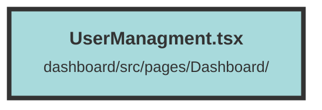

# UserManagment.tsx

### Purpose
The `UserManagement` component is designed to manage users and invitations within an organization. It provides functionalities to view, add, edit, and remove users, as well as manage invitations sent to potential users.

### Flow
1. **Initialization**:
   - The component imports necessary hooks and context from Solid.js and other modules.
   - Signals are created to manage state for users, invitations, modal visibility, and editing user.

2. **Fetching Data**:
   - `getUsers` and `getInvitations` functions fetch users and invitations from the API, respectively.
   - These functions handle errors and update the state with the fetched data.

3. **User and Invitation Management**:
   - `removeUser` and `deleteInvitation` functions handle the deletion of users and invitations, respectively, with confirmation prompts and success/error toasts.

4. **Effects**:
   - `createEffect` hooks are used to fetch users and invitations when the component mounts and to manage the visibility of invitations.

5. **Rendering**:
   - The component conditionally renders user and invitation lists based on the `showInvitations` signal.
   - It provides buttons to toggle between viewing users and invitations, and to open modals for adding users.
   - The `InviteUserModal` and `EditUserModal` components are used for inviting new users and editing existing users, respectively.

##### Auto generated documentation file from CodeViz.ai
