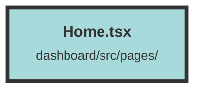

# Home.tsx

### Purpose
The `Home` component is responsible for handling user authentication and redirecting authenticated users to their respective dashboard. It ensures that users are logged in and, if not, redirects them to the login page.

### Flow
1. **Imports**: The file imports necessary functions and contexts from Solid.js and other local components.
2. **API Host**: Retrieves the API host URL from environment variables.
3. **User Context**: Accesses the `UserContext` to get user-related information.
4. **Login Function**:
   - Makes a fetch request to the `/auth/me` endpoint to check the user's authentication status.
   - If the user is not authenticated (status 401), redirects them to the login page.
   - If authenticated, redirects the user to their dashboard using the `selectedOrganizationId` from the `UserContext`.
   - Handles errors by logging them and displaying a toast notification.
5. **Effect**: Uses `createEffect` to call the `login` function when the component is rendered.
6. **Render**: Returns an empty `
` as the component does not need to render any visible content.

##### Auto generated documentation file from CodeViz.ai
