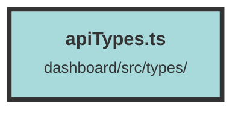

# apiTypes.ts

### Purpose
This file defines TypeScript interfaces and utility functions for managing users, organizations, datasets, and related entities in a system. It also includes type guards and conversion functions for roles and API keys.

### Flow
1. **Interfaces**: 
   - `SlimUser`, `UserOrganization`, `Organization`, `OrganizationAndSubAndPlan`, `StripeSubscription`, `StripePlan`, `OrganizationUsageCount`, `Dataset`, `DatasetUsageCount`, `DatasetAndUsage`, `ServerEnvsConfiguration`, `ClientEnvsConfiguration`, `DefaultError`, `ComboboxItem`, `ComboboxSection`, `SetUserApiKeyResponse`, `ApiKeyDTO`, `EventDTO`, `Event`, `Invitation`.
   - These interfaces define the structure of various entities like users, organizations, datasets, and events.

2. **Type Guards**:
   - `isComboboxValues`, `isEventDTO`, `isEvent`, `isInvitation`.
   - These functions check if a given object conforms to a specific interface.

3. **Enums and Conversion Functions**:
   - `UserRole`, `ApiKeyRole`.
   - Functions like `fromI32ToUserRole`, `fromUserRoleToI32`, `stringToUserRole`, `fromI32ToApiKeyRole`, `fromApiKeyRoleToI32`, `stringToApiKeyRole` convert between different representations of roles.

4. **Constants**:
   - `availableEmbeddingModels`.
   - This constant holds an array of available embedding models with their details.

##### Auto generated documentation file from CodeViz.ai
