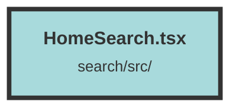

# HomeSearch.tsx


### Purpose
The `HomeSearch` component is designed to render the main search interface for the application. It integrates various sub-components and handles the configuration of search parameters based on the URL query string.

### Flow
1. **Context Initialization**: The component uses the `DatasetAndUserContext` to access the current dataset and client configuration.
   ```javascript
   const datasetAndUserContext = useContext(DatasetAndUserContext);
   ```

2. **Extracting Parameters**: It extracts search-related parameters from the URL query string.
   ```javascript
   const url = window.location.href;
   const requestParams = url.split("?")[1];
   const params = new URLSearchParams(requestParams);
   ```

3. **Parameter Defaults and Parsing**: Default values are set for various search parameters if they are not present in the URL.
   ```javascript
   const searchType = params.get("searchType") ?? "search";
   const groupUnique = params.get("groupUnique") === "true" || false;
   const slimChunks = params.get("slimChunks") === "true" || false;
   const pageSize = Number(params.get("pageSize")) || 10;
   const getTotalPages = params.get("getTotalPages") === "true" || false;
   const highlightResults = params.get("highlightResults") === "true" || true;
   const highlightDelimiters = params.get("highlightDelimiters")?.split(",").filter((delimiter) => delimiter !== "") ?? ["?", ".", "!"];
   const recencyBias = Number(params.get("recencyBias")) || 0.0;
   ```

4. **Rendering Components**: The component renders the `HomeNavbar`, `SearchForm`, `DefaultQueries`, and `Footer` components, passing the extracted parameters to `SearchForm`.
   ```javascript
   return (
     <div class="flex min-h-screen flex-col bg-white dark:bg-shark-800 dark:text-white">
       <HomeNavbar />
       <div class="space-y mt-12 flex w-full flex-col items-center">
         <div class="flex w-full items-center justify-center">
           <a class="flex items-center justify-center" href="/">
             
             <div>
               <div class="mb-[-1px] ml-1 w-full text-end align-bottom text-lg leading-3 text-turquoise">
                 {$dataset?.()?.dataset.name ?? "Dataset"}
               </div>
               <div class="text-4xl">
                 <span>Trieve</span>
                 <span class="text-magenta">Search</span>
               </div>
             </div>
           </a>
         </div>
         <div class="mt-8 w-full max-w-7xl px-4 sm:px-8 md:px-20">
           <SearchForm
             searchType={searchType}
             groupUniqueSearch={groupUnique}
             slimChunks={slimChunks}
             pageSize={pageSize}
             getTotalPages={getTotalPages}
             highlightDelimiters={highlightDelimiters}
             highlightResults={highlightResults}
             recencyBias={recencyBias}
           />
         </div>
       </div>
       <DefaultQueries suggestedQueries={suggestedQueries ?? []} />
       <div class="flex-1" />
       <Footer />
     </div>
   );
   ```

##### Auto generated documentation file from CodeViz.ai
