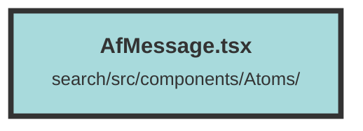

# AfMessage.tsx

### Purpose
The `AfMessage` component is designed to display messages in a chat interface, differentiating between user, assistant, and system roles. It handles the rendering of message content, including dynamic elements like buttons for navigating to specific document sections.

### Flow
1. **Imports and Interface Definition**:
   - Imports necessary libraries and components.
   - Defines the `AfMessageProps` interface to type the component's props.

2. **Component State and Effects**:
   - Uses `createSignal` to manage `selectedIds` and `content` state.
   - `createEffect` to initialize `content` with `props.content`.
   - Another `createEffect` to update `content` with clickable elements for document navigation when `streamingCompletion` is false.

3. **Rendering Logic**:
   - Uses the `Show` component to conditionally render content based on the `role` prop.
   - Applies different styles based on the `role` (user or assistant).
   - Renders an icon (`BiSolidUserRectangle` for user, `AiFillRobot` for assistant).
   - Sanitizes and sets the inner HTML of the content.
   - Displays a loading spinner if `content` is empty.
   - If the role is `assistant`, it renders a list of `ScoreChunk` components using the `For` directive, passing necessary props to each `ScoreChunk`.

##### Auto generated documentation file from CodeViz.ai
