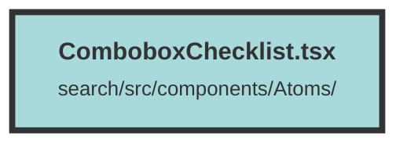

# ComboboxChecklist.tsx

### Purpose
The `Combobox` component is designed to provide a searchable dropdown list with selectable items. It allows users to filter through predefined options and add custom items dynamically.

### Flow
1. **State Initialization**:
   - `usingPanel` and `inputValue` signals are created to manage the state of the component.

2. **Filtering Items**:
   - `filteredItems` memo computes the list of items based on the current input value. It includes a special item for adding custom filters.

3. **Handling Clicks**:
   - `handleClick` function updates the selected state of items and allows adding custom items to the list. It also opens the popover.

4. **Rendering**:
   - The component renders a search input and a list of filtered items.
   - Each item is a button that toggles its selected state when clicked.
   - The search input updates `inputValue` on user input and triggers filtering.

5. **Styling and Interaction**:
   - The component includes various CSS classes for styling and managing focus and hover states.
   - Icons from `solid-icons` are used for visual cues in the search input and selected items.

##### Auto generated documentation file from CodeViz.ai
