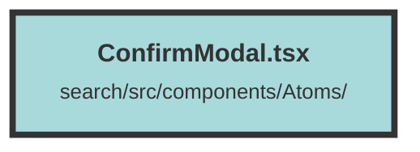

# ConfirmModal.tsx

### Purpose
The `ConfirmModal` component is designed to display a confirmation modal dialog. It prompts the user to confirm or cancel an action, typically a deletion, by providing a message and two buttons: "Delete" and "Cancel".

### Flow
1. **Import Statements**: The component imports necessary modules and icons from `solid-js` and other libraries.
2. **Interface Definition**: `ConfirmModalProps` defines the properties required by the `ConfirmModal` component, including state accessors and setters for modal visibility, a confirmation callback, and a message string.
3. **Component Definition**: 
   - The `ConfirmModal` component uses the `Show` component to conditionally render the modal based on the `showConfirmModal` state.
   - Inside the modal, it displays an icon (`BiRegularXCircle`), a message, and two buttons.
   - The "Delete" button triggers the `onConfirm` callback and hides the modal.
   - The "Cancel" button simply hides the modal without triggering any action.
4. **Styling**: The component uses Tailwind CSS classes for styling the modal, buttons, and icons.

##### Auto generated documentation file from CodeViz.ai
