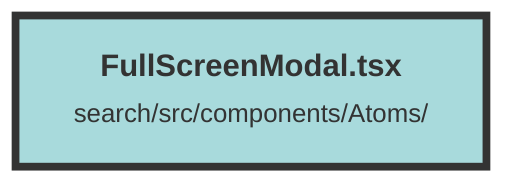

# FullScreenModal.tsx

### Purpose
The `FullScreenModal` component is designed to create a full-screen modal dialog in a Solid.js application. It provides a user-friendly way to display content in a modal overlay, ensuring that the modal is centered and styled appropriately.

### Flow
1. **Imports**: The component imports necessary modules from `solid-headless` and `solid-js`, including `Dialog`, `Transition`, and `Portal`.

2. **Props Interface**: The `FullScreenModalProps` interface defines the expected properties:
   - `children`: The content to be displayed inside the modal.
   - `isOpen`: A function that returns a boolean indicating if the modal is open.
   - `setIsOpen`: A function to set the modal's open state.

3. **Component Definition**: The `FullScreenModal` component:
   - Uses a `Portal` to render the modal outside the main DOM hierarchy.
   - Utilizes a `Transition` to handle the modal's appearance and disappearance animations.
   - Implements the `Dialog` component to manage the modal's open state and styling.
   - Includes a `DialogOverlay` for the background overlay effect.
   - Uses `TransitionChild` to animate the modal's content.
   - Sets the modal's open state to `false` and stores a flag in `localStorage` when the modal is closed.

4. **Styling and Animation**: The component applies various CSS classes for styling and animations, ensuring a smooth user experience.

##### Auto generated documentation file from CodeViz.ai
