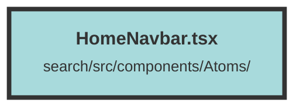

# HomeNavbar.tsx

### Purpose
The `HomeNavbar` component is designed to provide a navigation bar for the home page of the application. It includes links to various sections such as the dashboard, groups, and features like creating chunks and uploading files. The component also adapts to different user contexts and screen sizes.

### Flow
1. **Imports and Context Setup**:
   - Imports necessary modules and components.
   - Retrieves the `dashboardUrl` from environment variables.
   - Uses `DatasetAndUserContext` to get user and environment configurations.

2. **State Management**:
   - Uses `createSignal` to manage the state of the mobile menu (`isOpen`).

3. **Main Navigation Bar**:
   - Renders a navigation bar with a white or dark background based on the theme.
   - Displays organization and dataset selection boxes if a user is present.
   - Provides links to the dashboard, groups, and conditional links for creating chunks and uploading files based on feature flags from the environment configuration.

4. **Mobile Menu**:
   - Includes a button to toggle the mobile menu.
   - Displays the mobile menu with a link to upload files if the feature is enabled.

The component ensures responsiveness and accessibility by adapting to different screen sizes and providing appropriate ARIA attributes.

##### Auto generated documentation file from CodeViz.ai
