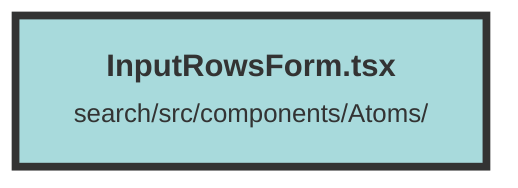

# InputRowsForm.tsx

### Purpose
The `InputRowsForm` component is designed to create a form with multiple input fields, each defined by an `InputGroup`. It provides a flexible way to handle different types of inputs and custom components, along with "Create" and "Cancel" buttons for form submission and cancellation.

### Flow
1. **Component Definition**: The `InputRowsForm` component takes `InputRowsFormProps` as its properties, which include button text, event handlers, and an array of `InputGroup` objects.
2. **Rendering Input Groups**: 
   - The component iterates over `inputGroups` using the `For` directive.
   - For each `InputGroup`, it renders a label and an input field based on the `type` or a custom component if provided.
   - Input fields are either `input` or `textarea` elements, and they update the corresponding `inputValue` using the `setInputValue` function.
3. **Buttons**: 
   - Two buttons are rendered at the bottom: "Cancel" and "Create".
   - The "Cancel" button triggers the `onCancel` function.
   - The "Create" button triggers the `onCreate` function and displays the `createButtonText`.
4. **Styling**: The component uses various CSS classes for styling, including support for dark mode.

##### Auto generated documentation file from CodeViz.ai
