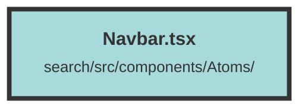

# Navbar.tsx

### Purpose
The `Navbar` component provides a responsive navigation bar for the application. It includes links to various sections such as the dashboard, groups, and conditional links for creating chunks and uploading files based on feature flags.

### Flow
1. **Imports and Context**: The component imports necessary modules and uses the `DatasetAndUserContext` to access user and environment configurations.
2. **State Management**: A signal `isOpen` is created to manage the state of the mobile menu.
3. **Main Navigation Bar**:
   - **Logo and User Context**: Displays the logo and, if a user is present, shows the `OrganizationSelectBox` and `DatasetSelectBox`.
   - **Links**: Provides links to the dashboard, groups, and conditionally to "Create Chunk" and "Upload File" based on feature flags.
4. **Mobile Menu**:
   - **Toggle Button**: A button toggles the visibility of the mobile menu.
   - **Conditional Links**: Displays "Create Chunk" and "Upload File" links if the respective features are enabled.

##### Auto generated documentation file from CodeViz.ai
