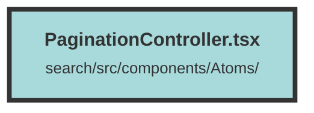

# PaginationController.tsx

### Purpose
The file provides a `PaginationController` component for navigating through pages in a web application. It includes buttons for moving to the previous and next pages and displays a range of page numbers centered around the current page.

### Flow
1. **createArrayWithCenteredRange Function**:
   - Generates an array of page numbers centered around the current page.
   - If the current page is near the start, it generates a sequence starting from 1.
   - Otherwise, it centers the range around the current page.

2. **PaginationController Component**:
   - Uses `useSearchParams` to manage URL query parameters for pagination.
   - Displays a left arrow button to navigate to the previous page if the current page is not the first page.
   - Uses the `createArrayWithCenteredRange` function to generate and display page number buttons.
   - Highlights the current page button and changes the page when a button is clicked.
   - Displays a right arrow button to navigate to the next page if the current page is not the last page.

##### Auto generated documentation file from CodeViz.ai
