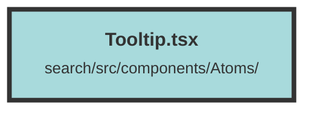

# Tooltip.tsx

### Purpose
The `Tooltip` component provides a way to display additional information when a user hovers over a specified element. It is designed to enhance user interaction by showing a tooltip with descriptive text.

### Flow
1. **Import Statements**: The component imports `Show` and `createSignal` from "solid-js" for reactive state management and conditional rendering.
2. **TooltipProps Interface**: Defines the properties `body` (JSX element to hover over) and `tooltipText` (text to display in the tooltip).
3. **State Management**: Uses `createSignal` to manage the visibility of the tooltip.
4. **Component Structure**:
   - **Wrapper Div**: Contains the element to hover over and the tooltip.
   - **Hover Events**: `onMouseEnter` and `onMouseLeave` events toggle the tooltip visibility.
   - **Show Component**: Conditionally renders the tooltip based on the `show` state.
   - **Tooltip Div**: Displays the tooltip text with styling for positioning and appearance.
   - **Caret Div**: Adds a small triangle to visually connect the tooltip to the hovered element.

##### Auto generated documentation file from CodeViz.ai
