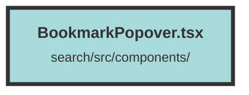

# BookmarkPopover.tsx

### Purpose
The `BookmarkPopover` component is designed to manage bookmarks and groups for a specific chunk of data. It allows users to view, add, and remove bookmarks, as well as create new groups for organizing chunks.

### Flow
1. **Imports and Context Setup**: The component imports necessary libraries and context, including Solid.js hooks, UI components from `solid-headless`, and icons. It also uses the `DatasetAndUserContext` to access user and dataset information.

2. **Component Props**: The `BookmarkPopover` component accepts several props, including metadata about the chunk, groups, total pages, and setters for login modal and chunk groups.

3. **State Management**: Various signals are created to manage the state, such as `refetchingChunkGroups`, `refetchingBookmarks`, `showGroupForm`, and others.

4. **Effects**:
   - **Initial Setup**: An effect initializes bookmarks and local chunk groups based on the provided props.
   - **Page Change**: An effect triggers when the local group page changes, refetching groups if necessary.
   - **User and Refetching State**: Effects handle refetching of groups and bookmarks when the user is logged in and the respective refetching signals are true.

5. **Refetch Functions**:
   - **refetchGroups**: Fetches chunk groups from the API and updates the local state.
   - **refetchBookmarks**: Fetches bookmarks for the current chunk and updates the local state.

6. **Popover and Menu**:
   - **PopoverButton**: A button that triggers the popover, checking if the user is logged in and refetching bookmarks if necessary.
   - **PopoverPanel**: Displays the menu for managing groups, including a list of groups with checkboxes to add/remove bookmarks, pagination controls, and a form to create new groups.

7. **Group Management**:
   - **Checkbox Handling**: Toggles the inclusion of a chunk in a group by making API calls.
   - **Pagination**: Allows navigation through different pages of groups.
   - **Group Creation**: Provides a form to create new groups, making an API call to save the new group and updating the state accordingly.

The component ensures that the user can efficiently manage bookmarks and groups, with real-time updates and a user-friendly interface.

##### Auto generated documentation file from CodeViz.ai
