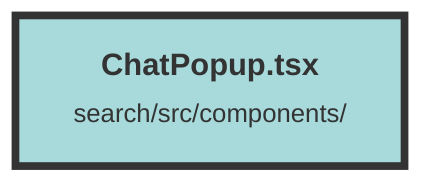

# ChatPopup.tsx

### Purpose
The `ChatPopup` component is designed to facilitate a chat interface within a web application. It allows users to send messages and receive responses from an assistant, leveraging a backend API for message generation and handling.

### Flow
1. **Initialization**:
   - The component imports necessary hooks and components from `solid-js` and other modules.
   - It defines the `LayoutProps` interface to type the props passed to the component.

2. **State Management**:
   - Several state signals are created using `createSignal` to manage loading states, messages, new message content, and streaming completion status.

3. **Helper Functions**:
   - `resizeTextarea`: Adjusts the height of the textarea based on its content.
   - `handleReader`: Reads and processes the response stream from the API, updating messages in real-time.
   - `fetchCompletion`: Sends a new message to the backend API and handles the response stream.
   - `fetchMessages`: Loads previous messages from local storage.

4. **Effects**:
   - `createEffect`: Clears previous messages and fetches new ones on component mount.

5. **Message Submission**:
   - `submitNewMessage`: Triggers the `fetchCompletion` function to send a new message.

6. **Message Filtering**:
   - `messageChunks`: Filters and returns relevant message chunks based on selected IDs.

7. **Rendering**:
   - The component renders a loading spinner if messages are being loaded.
   - Displays messages using the `AfMessage` component.
   - Provides a textarea for users to input new messages and a button to submit them.
   - Includes a button to stop message generation if streaming is in progress.

##### Auto generated documentation file from CodeViz.ai
