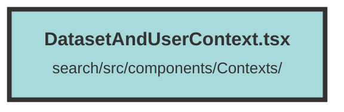

# DatasetAndUserContext.tsx

### Purpose
This file defines a context and a provider component for managing user, organization, and dataset information in a Solid.js application. It handles user authentication, organization selection, dataset management, and client configuration.

### Flow
1. **Imports and Interfaces**: The file imports necessary modules and defines interfaces for the context properties and notifications.
2. **Context Initialization**: A context (`DatasetAndUserContext`) is created with default values.
3. **Provider Component**: `DatasetAndUserContextWrapper` is defined to manage state and provide context values to its children.
   - **State Management**: Uses `createSignal` to manage state for user, organizations, current organization, datasets, and client configuration.
   - **Login Function**: Fetches user data and updates state upon successful login.
   - **Effects**: Several `createEffect` hooks are used to:
     - Automatically log in the user.
     - Update URL and local storage based on the current dataset and organization.
     - Fetch datasets for the selected organization.
     - Fetch client configuration for the current dataset.
4. **Context Provider**: The `DatasetAndUserContext.Provider` wraps the children components, passing down the state and functions as context values.

##### Auto generated documentation file from CodeViz.ai
