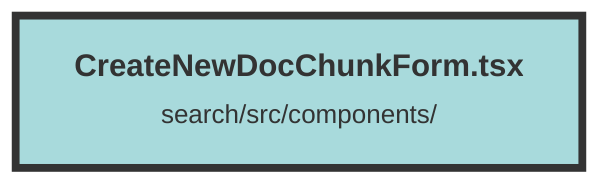

# CreateNewDocChunkForm.tsx

### Purpose
The `CreateNewDocChunkForm` component is designed to facilitate the creation and submission of new document chunks. It provides a form interface for users to input various details about the document chunk, such as content, tags, location, and weight, and then submit this information to an API endpoint.

### Flow
1. **Initialization**: The component initializes several state variables using Solid.js's `createSignal` to manage form inputs and submission states.
2. **Form Submission**: The `submitDocChunk` function handles form submission. It gathers input values, validates them, and constructs a request body.
3. **API Request**: The form data is sent to the API endpoint using a `fetch` request. If the user is not authenticated, a login modal is displayed.
4. **TinyMCE Editor**: The `createEffect` hook initializes the TinyMCE editor with specific options and shortcuts for text formatting.
5. **Form Rendering**: The form includes fields for document link, tags, date, location, weight, and chunk content. It also displays error messages and a warning if the TinyMCE editor fails to load.
6. **Conditional Rendering**: The component uses Solid.js's `Show` component to conditionally render the submission button state and the login modal.

Key elements:
- **State Management**: `createSignal` for managing form inputs and submission states.
- **Form Validation**: Checks for required fields and displays errors.
- **API Interaction**: Submits form data to the API and handles responses.
- **TinyMCE Integration**: Rich text editor for chunk content with custom shortcuts.
- **Conditional UI**: Displays different UI elements based on state (e.g., submission status, login modal).

##### Auto generated documentation file from CodeViz.ai
