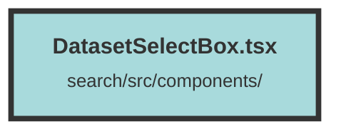

# DatasetSelectBox.tsx

### Purpose
The `DatasetSelectBox` component provides a user interface element for selecting a dataset from a list of available datasets. It displays the current dataset and allows users to switch between different datasets.

### Flow
1. **Context Usage**: The component uses the `DatasetAndUserContext` to access the list of datasets (`datasetsAndUsages`) and the currently selected dataset (`currentDataset`).

2. **Memoization**: The `datasetList` memo is created to efficiently manage the list of datasets.

3. **Conditional Rendering**: The component uses the `Show` component to conditionally render the dropdown only if there are datasets available.

4. **Popover and Menu**: 
   - A `Popover` component is used to create a dropdown menu.
   - The `PopoverButton` toggles the visibility of the dropdown.
   - The `PopoverPanel` contains a `Menu` with `MenuItem` elements for each dataset.

5. **Dataset Selection**: 
   - Each `MenuItem` displays the dataset name and highlights the currently selected dataset.
   - Clicking a `MenuItem` updates the current dataset using `setCurrentDataset` and closes the dropdown.

6. **Icons**: The component uses icons (`FiChevronDown`, `FiChevronUp`, `FaSolidCheck`) to indicate the dropdown state and the selected dataset.

##### Auto generated documentation file from CodeViz.ai
