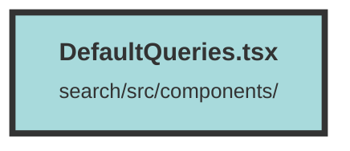

# DefaultQueries.tsx

### Purpose
The `DefaultQueries` component is designed to display a list of suggested search queries. It takes an array of suggested queries as a prop and renders them as clickable links.

### Flow
1. **Import Statements**: The component imports `For` and `Show` from the `solid-js` library.
2. **Component Definition**: The `DefaultQueries` component is defined to accept a `suggestedQueries` prop, which is an array of strings.
3. **Conditional Rendering**: The `Show` component checks if the `suggestedQueries` array has any elements.
4. **Container Div**: If there are suggested queries, a container `div` with specific styling is rendered.
5. **Title**: A `div` with the text "Suggested Queries" is displayed as a title.
6. **List of Queries**: The `For` component iterates over each query in the `suggestedQueries` array.
7. **Links**: Each query is rendered as an anchor (`<a>`) element with a URL that includes the query as a search parameter. The links are styled with a blue color and underline.

This structure ensures that the component only renders when there are suggested queries to display, and each query is presented as a clickable link for easy navigation.

##### Auto generated documentation file from CodeViz.ai
