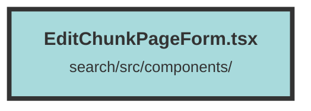

# EditChunkPageForm.tsx

### Purpose
The `EditChunkPageForm` component is designed to provide a user interface for editing a specific chunk of data. It allows users to update various metadata fields and the content of the chunk, and handles form submission to update the chunk on the server.

### Flow
1. **Initialization**: The component initializes several state variables using `createSignal` to manage form data and error states.
2. **Context and Props**: It retrieves the current dataset from the `DatasetAndUserContext` and initializes form fields with the default chunk metadata provided via `props`.
3. **Fetching Group IDs**: On component mount, it fetches group IDs associated with the chunk and updates the `groupIds` state.
4. **Error Handling**: If the chunk status is 401 or 404, it sets a top-level error message.
5. **Form Submission**: The `updateChunk` function handles form submission. It validates the form, constructs the request body, and sends a PUT request to update the chunk. It also handles various response statuses and updates the UI accordingly.
6. **Fetching Chunk Data**: Another effect fetches the chunk data from the server and populates the form fields.
7. **TinyMCE Initialization**: The component initializes the TinyMCE editor with specific options and shortcuts for editing the chunk content.
8. **Rendering**: The component renders a form with fields for link, tag set, date, location, weight, and chunk content. It also includes error messages and a modal for login if the user is not authenticated.

##### Auto generated documentation file from CodeViz.ai
