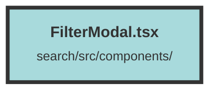

# FilterModal.tsx

### Purpose
The purpose of this file is to define and manage a modal component (`FilterModal`) for applying filters to a dataset. It allows users to add, modify, and save different types of filters (`must`, `must not`, `should`) to local storage and apply them to the current dataset.

### Flow
1. **Context and State Initialization**:
   - The `FilterModal` component uses the `DatasetAndUserContext` to access the current dataset.
   - Signals are created to manage the state of filter types and filter lists (`mustFilters`, `mustNotFilters`, `shouldFilters`).

2. **Filter Key Management**:
   - A memoized key (`curDatasetFiltersKey`) is generated based on the current dataset ID to uniquely identify the filters in local storage.

3. **Saving Filters**:
   - The `saveFilters` function serializes the current filters and saves them to local storage using the generated key. It also dispatches a `filtersUpdated` event and closes the modal.

4. **Loading Filters**:
   - An effect is created to load filters from local storage when the dataset changes. It parses the saved filters and updates the state accordingly.

5. **UI Components**:
   - The modal UI includes controls for changing filter types, adding new filters, resetting filters, and applying filters.
   - Filters are displayed in sections (`must`, `must not`, `should`) using the `Show` and `For` components to conditionally render and iterate over the filter lists.

6. **FilterItem Component**:
   - The `FilterItem` component manages individual filter settings, including field selection and filter mode (`match`, `geo_radius`, `range`, `date_range`).
   - It uses signals to manage the state of filter properties and updates the parent component when changes occur.

7. **Filter Mode Handling**:
   - Depending on the selected filter mode, different input fields are displayed for configuring the filter (e.g., latitude/longitude for `geo_radius`, date range for `date_range`).

8. **Event Handling**:
   - Event handlers are attached to UI elements to update the state and trigger actions like adding filters, resetting filters, and applying filters.

This modular approach ensures that filters are managed efficiently and can be easily extended or modified.

##### Auto generated documentation file from CodeViz.ai
