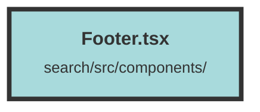

# Footer.tsx

### Purpose
The `Footer` component is designed to provide a consistent footer section for a web application. It includes links to various social media platforms and a theme mode controller.

### Flow
1. **Imports**: The file imports social media icons from the `solid-icons` library and a `ThemeModeController` component.
2. **Component Definition**: The `Footer` component is defined as a functional component.
3. **Structure**:
   - The outer `div` has classes for margin, flexbox layout, and padding.
   - The first inner `div` contains anchor tags (`<a>`) for social media links, each with hover effects and icons.
   - The second inner `div` contains an email address and the `ThemeModeController` component.
4. **Icons and Links**: Each social media link uses an icon component and directs to the respective platform in a new tab.
5. **Styling**: Tailwind CSS classes are used for layout and styling, including hover effects and dark mode adjustments.

##### Auto generated documentation file from CodeViz.ai
