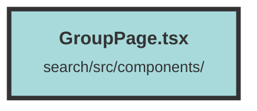

# GroupPage.tsx

### Purpose
The `GroupPage` component is designed to display and manage a group of chunks within a dataset. It provides functionalities for searching, editing, deleting, and viewing chunk metadata, as well as fetching related chunks and group recommendations.

### Flow
1. **Initialization**:
   - Imports necessary modules and components from `solid-js`, `solid-icons`, and local files.
   - Defines the `GroupPageProps` interface for component props.

2. **State Management**:
   - Uses `createSignal` to manage various states like `query`, `page`, `searchType`, `chunkMetadatas`, `groupInfo`, etc.
   - Initializes context using `useContext` to access dataset and user information.

3. **Lifecycle Methods**:
   - `onMount`: Fetches bookmarks when the component mounts.
   - `createEffect`: Multiple effects to handle state changes, fetch data, and update the UI accordingly.

4. **Data Fetching**:
   - Fetches chunk groups, bookmarks, and group information based on the current state and user actions.
   - Handles search queries and updates the chunk metadata accordingly.

5. **Event Handlers**:
   - Provides functions to handle group updates, fetch recommendations, and resize text areas.
   - Includes handlers for editing, deleting, and navigating between pages.

6. **Rendering**:
   - Conditionally renders UI elements based on the current state, such as loading indicators, error messages, search results, and chunk metadata.
   - Uses `Show`, `For`, and `Switch` components from `solid-js` for conditional rendering and looping through data.

7. **Modals and Popups**:
   - Includes `FullScreenModal` for chat functionality and `ConfirmModal` for delete confirmations.
   - Provides buttons to open these modals and handle user interactions.

8. **Pagination and Recommendations**:
   - Implements pagination controls to navigate through pages of chunk metadata.
   - Fetches and displays related chunks and group recommendations based on user actions.

The component is structured to handle various user interactions and state changes efficiently, providing a comprehensive interface for managing chunk groups within a dataset.

##### Auto generated documentation file from CodeViz.ai
