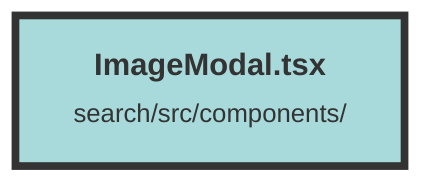

# ImageModal.tsx

### Purpose
The `ImageModal` component is designed to display a modal containing a series of images. It fetches signed URLs for images from an API and displays them in a full-screen modal.

### Flow
1. **Imports and Context**: The component imports necessary hooks and components from `solid-js` and other local files. It also uses the `DatasetAndUserContext` to access the current dataset.

2. **Props Definition**: The `ImageModalProps` interface defines the expected props: `showImageModal`, `setShowImageModal`, and `imgInformation`.

3. **State Management**: 
   - `apiHost` is set from environment variables.
   - `datasetAndUserContext` provides access to the current dataset.
   - `signedImageUrlsHashmap` is a signal to store the fetched signed URLs.

4. **Effect Hook**: 
   - `createEffect` is used to fetch signed URLs for the images when `imgInformation` changes.
   - It calculates the range of images to fetch based on `imgRangeStart` and `imgRangeEnd`.
   - For each image, it constructs the filename and fetches the signed URL from the API.
   - The fetched URLs are stored in `signedImageUrlsHashmap`.

5. **Rendering**:
   - The component uses the `Show` component to conditionally render the modal based on `showImageModal`.
   - Inside the modal, it uses the `For` component to iterate over the image range and display each image using the fetched signed URLs.

##### Auto generated documentation file from CodeViz.ai
