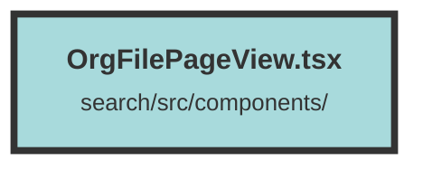

# OrgFilePageView.tsx

### Purpose
The `OrgFileViewPage` component is designed to display and manage files associated with a specific dataset. It allows users to view, paginate through, and delete files within the dataset.

### Flow
1. **Initialization**: The component initializes several state variables using Solid.js signals, such as `loading`, `fileAndGroupIds`, `filePage`, `filePageCount`, and `deleting`.

2. **Data Fetching**: 
   - A `createEffect` hook fetches file data from the API when the component mounts or when the `filePage` signal changes.
   - The API call retrieves file information and updates the `fileAndGroupIds` and `filePageCount` signals.

3. **Delete File**: 
   - The `deleteFile` function sets up a deletion confirmation modal.
   - If confirmed, it sends a DELETE request to the API to remove the file and updates the state accordingly.

4. **Rendering**:
   - The component uses a `Switch` statement to handle different UI states: loading, no files found, and displaying files.
   - When files are available, it renders a table with file names, creation dates, and delete buttons.
   - Pagination controls allow users to navigate through different pages of files.

5. **Conditional UI**:
   - The UI adapts based on the user's presence and the loading state, providing appropriate feedback and controls.

##### Auto generated documentation file from CodeViz.ai
