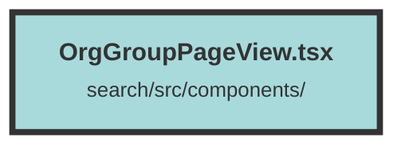

# OrgGroupPageView.tsx

### Purpose
The `GroupUserPageView` component is designed to display and manage groups associated with a specific dataset. It allows users to view group details, navigate through pages of groups, and delete groups if necessary.

### Flow
1. **Context and State Initialization**:
   - The component uses `DatasetAndUserContext` to access the current dataset and user information.
   - Several state signals are initialized to manage groups, pagination, and deletion status.

2. **Data Fetching**:
   - An effect is created to fetch groups from the API whenever the user or dataset changes, or when the page number updates.
   - The fetched data is validated and used to update the groups and pagination state.

3. **Group Deletion**:
   - The `deleteGroup` function sets up a deletion handler that sends a DELETE request to the API.
   - Upon successful deletion, the group is removed from the state, and the deletion status is updated.

4. **Rendering**:
   - The component conditionally renders a message if no groups are found.
   - It displays a table of groups with columns for name, description, creation date, and a delete button.
   - Pagination controls allow users to navigate through different pages of groups.

##### Auto generated documentation file from CodeViz.ai
