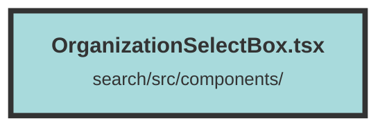

# OrganizationSelectBox.tsx

### Purpose
The `OrganizationSelectBox` component provides a dropdown menu for selecting an organization from a list. It displays the current organization and allows users to switch between different organizations.

### Flow
1. **Context Usage**: The component uses `DatasetAndUserContext` to access the list of organizations and the current organization.
2. **Memoization**: `createMemo` is used to memoize the list of organizations for performance optimization.
3. **Popover Component**: A `Popover` component is used to create the dropdown menu. It toggles between open and closed states.
4. **PopoverButton**: Displays the current organization's name and a chevron icon indicating the dropdown state.
5. **PopoverPanel**: Contains the list of organizations, rendered using the `Menu` and `MenuItem` components.
6. **Organization Selection**: Clicking on a `MenuItem` sets the selected organization as the current organization and closes the dropdown.
7. **Conditional Rendering**: The `Show` component conditionally renders the `PopoverPanel` based on the dropdown's open state.
8. **Icons**: `FiChevronDown`, `FiChevronUp`, and `FaSolidCheck` icons are used for visual indicators.

##### Auto generated documentation file from CodeViz.ai
