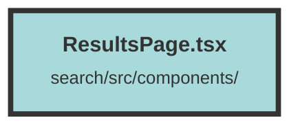

# ResultsPage.tsx

### Purpose
The `ResultsPage` component is designed to display search results based on user queries. It handles fetching data from an API, managing state, and rendering the results in a paginated format. It also provides functionalities for filtering, bookmarking, and interacting with the search results through a chat interface.

### Flow
1. **Initialization**: The component initializes various state signals using `createSignal` to manage data such as search results, bookmarks, filters, and UI states.

2. **Fetching Data**:
   - `fetchChunkCollections`: Fetches chunk collections from the API and updates the state.
   - `fetchBookmarks`: Fetches bookmarks for the current search results and updates the state.

3. **Search Effect**:
   - A `createEffect` hook triggers a search request whenever the query, page, or filters change.
   - Constructs the request body and determines the appropriate search route.
   - Sends a POST request to the API and processes the response to update the search results and pagination.

4. **Filters and Bookmarks**:
   - Another `createEffect` hook manages filters by fetching them from local storage and updating the state when filters are updated.
   - Fetches bookmarks whenever the filters change.

5. **UI Rendering**:
   - Uses `Switch` and `Match` components to conditionally render different UI states (loading, no results, results).
   - Renders search results using `For` loops to iterate over the result chunks and group result chunks.
   - Provides pagination controls and a chat interface for interacting with the results.

6. **Chat Interface**:
   - Displays a chat popup when the user selects results to chat with.
   - Provides buttons to chat with all results or selected results.

7. **Cleanup**:
   - Uses `onCleanup` to abort ongoing fetch requests when the component is unmounted.

8. **Confirm Modal**:
   - Renders a confirmation modal for deleting chunks, with the `onDelete` handler passed as a prop.

##### Auto generated documentation file from CodeViz.ai
