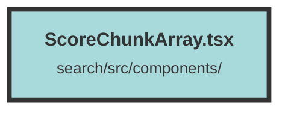

# ScoreChunkArray.tsx

### Purpose
The `ScoreChunkArray` component is designed to display an array of score chunks with navigation controls. It allows users to navigate through different chunks and view their metadata within a specified date range.

### Flow
1. **Context and Signals Initialization**:
   - The component uses the `DatasetAndUserContext` to access client configuration.
   - Signals `curChunk`, `beginTime`, and `endTime` are created to manage the current chunk index and the date range.

2. **onMount Hook**:
   - On component mount, it iterates through the `chunks` prop to determine the earliest and latest dates based on the `DATE_RANGE_VALUE` from the context.

3. **Date Extraction**:
   - For each chunk, it checks if the metadata contains a valid date string.
   - Uses a regex to extract and parse the date, updating `beginTime` and `endTime` accordingly.

4. **Rendering**:
   - The component renders navigation buttons (`FiChevronLeft` and `FiChevronRight`) to move between chunks.
   - The `ScoreChunk` component is rendered with the current chunk's data and metadata.

5. **Navigation**:
   - The left button decreases `curChunk` to show the previous chunk.
   - The right button increases `curChunk` to show the next chunk.

##### Auto generated documentation file from CodeViz.ai
