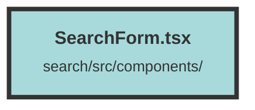

# SearchForm.tsx

### Purpose
The `SearchForm` component is designed to provide a comprehensive search interface with various configurable options. It allows users to input search queries, select search types, and apply filters and options to refine their search results.

### Flow
1. **Imports and Context**: The component imports necessary libraries and contexts, including icons, navigation, and state management utilities from Solid.js and Solid Headless.
2. **Props and Initial State**: The component accepts several props for configuration, such as `query`, `searchType`, `groupUniqueSearch`, etc. It initializes state variables using `createSignal` for managing search types, input values, and various search options.
3. **Textarea Resizing**: The `resizeTextarea` function dynamically adjusts the height of the textarea based on its content.
4. **Form Submission**: The `onSubmit` function handles form submission, constructs the search URL with appropriate query parameters, and navigates to the search results page.
5. **Effects**: 
   - `createEffect` hooks are used to synchronize props with state variables and manage side effects like resizing the textarea and handling typewriter effects for placeholder text.
   - The typewriter effect simulates typing and deleting text in the textarea when it is not focused and has no input.
6. **Memoized Value**: The `textareaVal` memo combines the actual input value, focus state, and typewriter effect to determine the displayed value in the textarea.
7. **Render**: The component renders a form with:
   - A search input area with a textarea and search button.
   - Popovers for filters, search type selection, and additional options.
   - Conditional rendering for group search options.
8. **Event Handling**: Event handlers manage user interactions, such as input changes, form submission, and toggling options.

The component is designed to be flexible and responsive, providing a rich user experience for performing searches with various configurations.

##### Auto generated documentation file from CodeViz.ai
