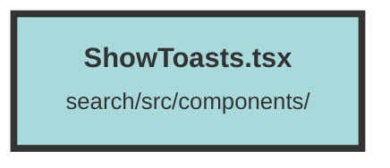

# ShowToasts.tsx

### Purpose
The file defines a toast notification system for a Solid.js application. It includes functionality to create and display toast messages, which can be either success or error notifications.

### Flow
1. **Imports**: The file imports necessary functions and icons from Solid.js and solid-icons libraries.
2. **Interfaces**: Defines `ToastDetail` and `ToastEvent` interfaces to structure the toast data.
3. **createToast Function**: Dispatches a custom event `show-toast` with the toast details.
4. **ShowToast Component**:
   - **State Management**: Uses `createSignal` to manage the list of toast messages.
   - **Effect**: Sets up an effect to listen for `show-toast` events, adding new toasts to the state and removing them after 1.5 seconds.
   - **Cleanup**: Ensures event listeners and timeouts are cleaned up when the component is unmounted.
   - **Rendering**: Renders a list of toast messages with appropriate styling and icons based on the toast type. Each toast can be manually dismissed by clicking the close icon.

##### Auto generated documentation file from CodeViz.ai
