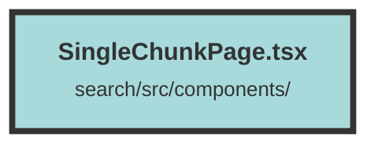

# SingleChunkPage.tsx

### Purpose
The `SingleChunkPage` component is designed to display a single chunk of data, including its metadata, related chunks, and user interactions such as bookmarking and recommendations. It also provides functionalities for fetching chunk groups, bookmarks, and recommendations, and includes a chat feature for interacting with the document.

### Flow
1. **Imports and Context Setup**: The file imports necessary modules and components from `solid-js`, `apiTypes`, and other local components. It also sets up the `DatasetAndUserContext` for accessing the current dataset and user information.

2. **Component Props**: The `SingleChunkPage` component accepts `chunkId` and `defaultResultChunk` as props.

3. **State Initialization**: Various signals are created to manage the state, including `chunkMetadata`, `error`, `fetching`, `chunkGroups`, `bookmarks`, `showConfirmDeleteModal`, `totalGroupPages`, `onDelete`, `clientSideRequestFinished`, `loadingRecommendations`, `recommendedChunks`, `openChat`, `selectedIds`, and `scoreChunk`.

4. **Error Handling**: Checks the status of `defaultResultChunk` and sets appropriate error messages if the chunk is not authorized or not found.

5. **Data Fetching**:
   - `fetchChunkGroups`: Fetches chunk groups for the authenticated user.
   - `fetchBookmarks`: Fetches bookmarks for the current chunk.
   - `fetchRecommendations`: Fetches recommended chunks based on positive chunk IDs.

6. **Effects**:
   - `createEffect`: Triggers `fetchChunkGroups` and `fetchBookmarks` on component mount.
   - `createEffect`: Fetches chunk metadata based on `chunkId`.

7. **Rendering**:
   - Displays loading and error messages based on the state.
   - Renders the main chunk using the `ScoreChunk` component.
   - Displays related chunks and a button to fetch more recommendations.
   - Includes a chat feature using `FullScreenModal` and `ChatPopup`.
   - Provides a floating action button for opening the chat with the document.
   - Includes a `ConfirmModal` for confirming chunk deletion.

8. **Return Statement**: The component returns a JSX structure that conditionally renders various parts of the UI based on the state.

##### Auto generated documentation file from CodeViz.ai
