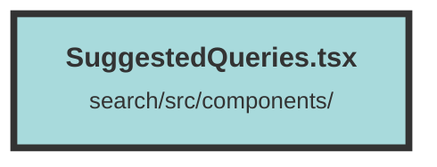

# SuggestedQueries.tsx

### Purpose
The `SuggestedQueries` component fetches and displays a list of suggested queries based on a user's input query. It interacts with an API to retrieve these suggestions and displays them conditionally based on the authentication status and the availability of suggestions.

### Flow
1. **Initialization**: The component initializes two signals: `suggestedQueries` to store the fetched suggestions and `authed` to track authentication status. It also retrieves the API host and the current dataset from the context.

2. **Effect Hook**: A `createEffect` hook is used to fetch suggested queries from the API whenever the dataset or the input query changes. The request includes the dataset ID and the user's query in the body.

3. **API Call**: The component makes a POST request to the `/chunk/gen_suggestions` endpoint. If the response is not OK, it sets `authed` to false. Otherwise, it updates `suggestedQueries` with the fetched data.

4. **Rendering**: 
   - If authenticated (`authed` is true), it displays the suggested queries.
   - If there are no suggestions, it shows placeholder elements with a pulsing animation.
   - Each suggested query is rendered as a clickable link that redirects to a search page with the query as a parameter.

##### Auto generated documentation file from CodeViz.ai
