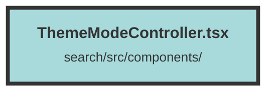

# ThemeModeController.tsx

### Purpose
The file defines a `ThemeModeController` component that allows users to toggle between light, dark, and system theme modes. It manages the theme state and updates the document's class and local storage accordingly.

### Flow
1. **Imports**: The file imports necessary components and hooks from `solid-headless` and `solid-js`, as well as icons from `solid-icons`.
2. **Theme Functions**:
   - `setThemeMode`: Sets the theme mode, updates the document's class, and stores the mode in local storage.
   - `getThemeMode`: Retrieves the current theme mode from local storage or defaults to "system".
   - `clearThemeMode`: Clears the theme mode from local storage and sets the theme based on the system preference.
3. **ThemeModeController Component**:
   - **State Management**: Uses `createSignal` to manage the current theme state.
   - **Effect**: Uses `createEffect` to apply the dark mode class if the current theme is dark or system preference is dark.
   - **UI**: Renders a `Popover` with a `PopoverButton` to toggle the theme menu. The menu contains `MenuItem` components for selecting light, dark, or system theme modes.
   - **Transitions**: Uses `Transition` for smooth showing and hiding of the popover and menu items.
   - **Event Handlers**: Each `MenuItem` updates the theme mode and current theme state when clicked.

##### Auto generated documentation file from CodeViz.ai
