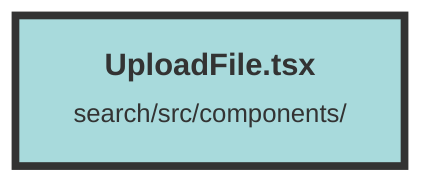

# UploadFile.tsx

### Purpose
The `UploadFile` component allows users to upload files to a server. It provides a user interface for selecting a file, optionally adding a link, tags, and a timestamp, and then submitting the file for processing.

### Flow
1. **Context and State Initialization**:
   - The component uses the `DatasetAndUserContext` to access the current dataset.
   - Several signals are created to manage the file, link, tags, submission state, error messages, and timestamp.

2. **File Handling**:
   - `handleDragUpload` and `handleDirectUpload` functions handle file selection via drag-and-drop and direct input, respectively.

3. **File Submission**:
   - `submitEvidence` function handles the file upload process:
     - Validates the presence of a file.
     - Converts the file to a Base64 string.
     - Constructs the request body with the file data, link, tags, and timestamp.
     - Sends a POST request to the server with the file data.
     - Updates the UI based on the response.

4. **UI Components**:
   - Displays error messages and submission success messages.
   - Provides input fields for the link, tags, and timestamp.
   - Includes a drag-and-drop area and a file input for file selection.
   - A submit button triggers the file upload process.

##### Auto generated documentation file from CodeViz.ai
