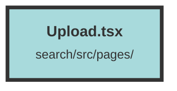

# Upload.tsx

### Purpose
The `Upload` component is designed to provide a user interface for uploading new evidence files. It ensures that the document upload feature is enabled and guides the user through the upload process.

### Flow
1. **Imports**: The component imports necessary modules and components such as `Footer`, `UploadFile`, `SearchLayout`, `useNavigate`, and `DatasetAndUserContext`.
2. **Context and Navigation**: It uses the `useNavigate` hook for navigation and `useContext` to access the `DatasetAndUserContext`.
3. **Feature Check**: The component checks if the `DOCUMENT_UPLOAD_FEATURE` is enabled in the environment configuration. If not, it redirects the user to a 404 page.
4. **Layout and Content**: 
   - Uses `SearchLayout` to wrap the content.
   - Displays a logo and a heading "Upload New Evidence File".
   - Shows a warning about potential upload times for large files.
   - Renders the `UploadFile` component for the actual file upload functionality.
   - Includes a `Footer` component at the bottom of the layout.

##### Auto generated documentation file from CodeViz.ai
