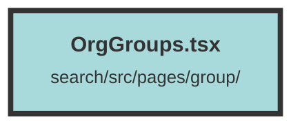

# OrgGroups.tsx

### Purpose
The `OrgGroups` component is designed to manage and display organizational groups within a user interface. It integrates various sub-components to provide a cohesive layout for viewing and deleting groups.

### Flow
1. **State Management**: 
   - `showConfirmGroupDeleteModal` and `onGroupDelete` are signals created using `createSignal` to manage the visibility of the confirmation modal and the delete action respectively.

2. **Layout**:
   - The component is wrapped in a `SearchLayout` to provide a consistent layout structure.

3. **Main Content**:
   - A `div` container with specific styling holds the main content.
   - `GroupUserPageView` is used to display the group information and provides handlers (`setOnDelete` and `setShowConfirmModal`) to manage group deletion.

4. **Confirmation Modal**:
   - `ConfirmModal` is rendered to confirm the deletion action. It uses the `showConfirmGroupDeleteModal` signal to control its visibility and `onGroupDelete` to execute the delete action upon confirmation.

5. **Footer**:
   - A `Footer` component is included at the bottom of the layout for additional page information or navigation.

The component effectively combines these elements to create a functional and interactive user interface for managing organizational groups.

##### Auto generated documentation file from CodeViz.ai
