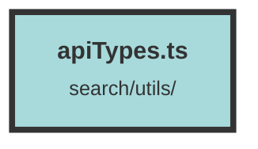

# apiTypes.ts

### Purpose
This file defines various TypeScript interfaces and utility functions for handling metadata, user data, and other related entities in a system. It includes type guards to ensure type safety and utility functions for common operations.

### Flow
1. **Interfaces**: The file defines multiple interfaces such as `ChunkMetadata`, `ChunkMetadataWithScore`, `APIRequest`, `ChunkGroupDTO`, `SlimUser`, `UserDTO`, `DatasetDTO`, and others. These interfaces represent the structure of various data entities used in the system.

2. **Type Guards**: Functions like `isChunkMetadata`, `isScoreChunkDTO`, `isUserDTO`, and others are type guards that check if a given object conforms to a specific interface. These functions use the `indirectHasOwnProperty` utility to verify the presence and type of required properties.

3. **Utility Functions**:
   - `indirectHasOwnProperty`: Checks if an object has a specific property.
   - `detectReferralToken`: Manages referral tokens in `localStorage`.
   - `getReferralTokenArray`: Retrieves referral tokens from `localStorage`.
   - `messageRoleFromIndex`: Determines the role of a message based on its index.

4. **Default Configurations**: The `defaultClientEnvsConfiguration` object provides default values for various client environment configurations.

5. **Type Definitions**: The file also defines types like `UserDTOWithVotesAndChunks`, `UserDTOWithScore`, `NotificationDTO`, `MatchCondition`, and `FieldCondition` to handle more complex data structures and conditions.

6. **Data Transfer Objects (DTOs)**: Interfaces like `ChunkGroupBookmarksDTO`, `FileDTO`, `NotificationWithPagesDTO`, and others represent data transfer objects used for API communication.

7. **Chunk Filtering**: The `ChunkFilter` interface and related types (`Range`, `FieldCondition`, `MatchCondition`) define the structure for filtering chunks based on various conditions.

Overall, the file provides a comprehensive set of type definitions, type guards, and utility functions to ensure type safety and facilitate common operations in the system.

##### Auto generated documentation file from CodeViz.ai
