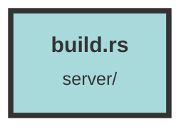

# build.rs

### Purpose
This file is designed to manage environment variables for a Rust project. It reads variables from a `.env` file and sets them for the build process, ensuring that the environment is correctly configured.

### Flow
1. **Conditional Compilation**: The file uses conditional compilation to differentiate behavior based on the presence of the `runtime-env` feature.
   - If the `runtime-env` feature is **not** enabled, the first `main` function is used.
   - If the `runtime-env` feature **is** enabled, the second `main` function is used, which does nothing and returns `Ok(())`.

2. **Environment Setup**:
   - The `dotenvy::dotenv().expect("Failed to read .env file. Did you `cp .env.dist .env` ?");` line loads environment variables from a `.env` file.
   - The `for (key, value) in env::vars()` loop iterates over all environment variables and prints them in the format `cargo:rustc-env={key}={value}`.
   - The `println!("cargo:rerun-if-changed=.env");` line ensures that Cargo will re-run the build script if the `.env` file changes.

3. **Error Handling**: Both `main` functions return a `Result<(), Box<dyn Error>>`, ensuring that any errors are properly propagated.

##### Auto generated documentation file from CodeViz.ai
