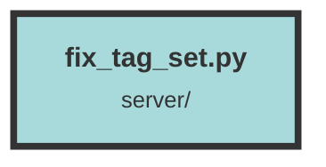

# fix_tag_set.py

### Purpose
This script is designed to connect to a PostgreSQL database and update the `tag_set` column in the `chunk_metadata`, `chunk_group`, and `files` tables. It converts the `tag_set` field from a comma-separated string to an array format within PostgreSQL.

### Flow
1. **Environment Setup**: The script starts by loading environment variables using `dotenv.load_dotenv()` to get the PostgreSQL connection details.

2. **Database Connection**: It establishes a connection to the PostgreSQL database using `psycopg2.connect()` with the connection details retrieved from the environment variables.

3. **Cursor Creation**: A cursor object is created to interact with the database.

4. **Table Iteration**: The script iterates over the `chunk_metadata`, `chunk_group`, and `files` tables.

5. **UUID Initialization**: A UUID (`lastBusiness_id`) is initialized to zero to keep track of the last processed record.

6. **Data Retrieval and Processing**:
    - The script retrieves rows in batches of 1000 where the `id` is greater than the `lastBusiness_id`.
    - For each row, it checks if the `tag_set` field is not empty.
    - If `tag_set` is present, it splits the comma-separated string into an array and updates the `tag_set_array` column in the database.

7. **Loop Continuation**: The loop continues fetching and processing rows until no more rows are returned.

8. **Commit Changes**: After processing all rows, the script commits the changes to the database.

9. **Cleanup**: Finally, the cursor and database connection are closed.

##### Auto generated documentation file from CodeViz.ai
