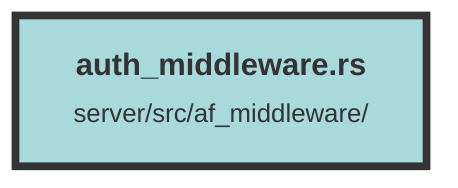

# auth_middleware.rs

### Purpose
The purpose of this file is to implement an authentication middleware for an Actix web application. This middleware handles user authentication and authorization by verifying user identities, roles, and permissions based on incoming HTTP requests.

### Flow
1. **Middleware Initialization**: The `AuthMiddlewareFactory` struct implements the `Transform` trait to create instances of `AuthenticationMiddleware`. The `new_transform` method initializes the middleware with the given service.

2. **Service Call**: The `call` method in `AuthenticationMiddleware` is invoked for each incoming request. It starts a Sentry transaction for tracing.

3. **User Retrieval**: The `get_user` function is called to retrieve the user from the request. It checks for user identity in the session, Redis cache, or via API key in the headers.

4. **Dataset and Organization Handling**: The middleware checks for `TR-Dataset` or `TR-Organization` headers to fetch the corresponding dataset and organization details. It inserts these details into the request extensions.

5. **User Role Verification**: If a user is found, their role within the organization is verified. If the user has the necessary permissions, their role is inserted into the request extensions.

6. **Forward Request**: The request is then forwarded to the next service in the chain. The middleware ensures that all necessary user and organization information is available for subsequent handlers.

7. **Error Handling**: Various error checks are in place to handle invalid headers, missing permissions, and other potential issues, returning appropriate error responses when necessary.

##### Auto generated documentation file from CodeViz.ai
