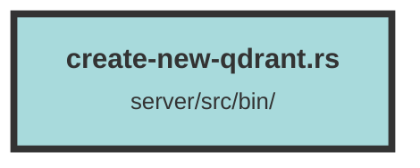

# create-new-qdrant.rs

### Purpose
This file is designed to manage a Qdrant collection by first deleting an existing field index and then creating a new collection query. It ensures that the Qdrant environment variables are correctly set up and utilized.

### Flow
1. **Environment Setup**: The program starts by loading environment variables using `dotenvy::dotenv().ok()`.
2. **Variable Initialization**: It retrieves the `QDRANT_URL`, `QDRANT_API_KEY`, and `QDRANT_COLLECTION` from the environment variables, providing default values if they are not set.
3. **Qdrant Connection**: It establishes a connection to the Qdrant server using `get_qdrant_connection`.
4. **Delete Field Index**: The program deletes the "content" field index from the specified Qdrant collection.
5. **Create New Collection Query**: Finally, it creates a new Qdrant collection query using the provided URL, API key, and collection name.

The program uses asynchronous operations and error handling to ensure smooth execution and proper error reporting.

##### Auto generated documentation file from CodeViz.ai
