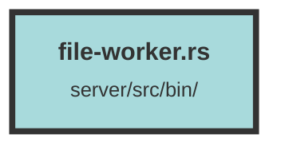

# file-worker.rs

### Purpose
This file is responsible for initializing and running a file worker service that processes files from a Redis queue, uploads them to an S3 bucket, and handles errors and retries. It also sets up monitoring, logging, and database connections.

### Flow
1. **Environment Setup**: Loads environment variables using `dotenvy::dotenv().ok()`.
2. **Sentry Initialization**: Configures Sentry for error tracking if `SENTRY_URL` is set.
3. **Thread Configuration**: Determines the number of threads to use based on the `THREAD_NUM` environment variable or system parallelism.
4. **Database Connection**: Establishes a connection to the PostgreSQL database using `diesel_async` and `deadpool`.
5. **Tokio Runtime**: Creates a Tokio runtime to handle asynchronous operations.
6. **Redis Connection**: Sets up a Redis connection pool using `bb8_redis`.
7. **Signal Handling**: Registers a shutdown hook for `SIGTERM` to gracefully terminate the service.
8. **File Worker Threads**: Spawns multiple threads to process files from the Redis queue.
9. **File Processing**: Each thread runs the `file_worker` function, which:
   - Retrieves a file from the Redis queue.
   - Uploads the file to an S3 bucket.
   - Parses the file using Tika.
   - Creates database entries and file chunks if required.
   - Handles errors and retries by re-adding failed tasks to the Redis queue.
10. **Error Handling**: The `readd_error_to_queue` function handles retries for failed file processing tasks.

##### Auto generated documentation file from CodeViz.ai
