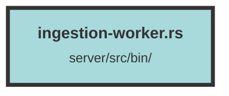

# ingestion-worker.rs

### Purpose
The purpose of this file is to manage the ingestion of data chunks into a database and a vector search engine (Qdrant). It handles bulk uploads and updates of data chunks, processes them, and manages connections to PostgreSQL and Redis databases. Additionally, it integrates with Sentry for error monitoring and tracing.

### Flow
1. **Initialization**:
   - Loads environment variables using `dotenvy`.
   - Initializes Sentry for error monitoring if `SENTRY_URL` is set.
   - Configures tracing and logging.
   - Sets up database connection pools for PostgreSQL and Redis.

2. **Main Function**:
   - Determines the number of threads to use.
   - Establishes a connection to the PostgreSQL database.
   - Creates a connection pool for PostgreSQL using `diesel_async`.
   - Creates a connection pool for Redis using `bb8_redis`.
   - Registers a shutdown hook for graceful termination.
   - Spawns multiple ingestion worker threads.

3. **Ingestion Worker**:
   - Continuously fetches messages from the Redis queue.
   - Processes each message based on its type (`BulkUpload` or `Update`).
   - For `BulkUpload`, it calls `bulk_upload_chunks` to handle the bulk upload of chunks.
   - For `Update`, it calls `update_chunk` to handle the update of a chunk.
   - Handles errors and retries failed operations.

4. **Bulk Upload Chunks**:
   - Precomputes data before insertion.
   - Inserts chunk metadata into the PostgreSQL database.
   - Creates embeddings for the chunks.
   - Upserts points into the Qdrant vector search engine.
   - Handles collisions and duplicate detection.

5. **Upload Chunk**:
   - Processes a single chunk upload.
   - Converts HTML to text if required.
   - Creates embeddings and sparse vectors.
   - Handles collisions and updates Qdrant points if necessary.
   - Inserts chunk metadata into the PostgreSQL database.

6. **Update Chunk**:
   - Updates the metadata and embeddings of an existing chunk.
   - Updates the corresponding Qdrant point.

7. **Error Handling**:
   - Re-adds failed messages to the Redis queue for retry.
   - Logs errors and creates events in the database for monitoring.

The file uses various libraries and modules such as `chrono`, `diesel_async`, `qdrant_client`, `sentry`, `signal_hook`, `tracing_subscriber`, and custom modules from `trieve_server`.

##### Auto generated documentation file from CodeViz.ai
