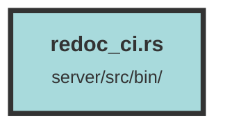

# redoc_ci.rs

### Purpose
This file generates and prints a pretty-formatted JSON representation of the OpenAPI documentation for the `trieve_server` API.

### Flow
1. **Imports**: The file imports `ApiDoc` from `trieve_server` and `OpenApi` from `utoipa`.
2. **Main Function**: 
   - Calls `ApiDoc::openapi()` to generate the OpenAPI documentation.
   - Converts the documentation to a pretty-formatted JSON string using `to_pretty_json()`.
   - Prints the JSON string to the console.
   - Returns `Ok(())` to indicate successful execution.

##### Auto generated documentation file from CodeViz.ai
