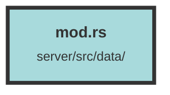

# mod.rs

### Purpose
This file serves as the main module declaration for a Rust project. It organizes the project by declaring submodules, which are `models` and `schema`.

### Flow
The file uses the `pub mod` keyword to publicly declare two submodules: `models` and `schema`. This allows other parts of the project to access the contents of these submodules. The `models` module typically contains data structures and business logic, while the `schema` module usually defines the database schema.

##### Auto generated documentation file from CodeViz.ai
