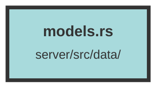

# models.rs

### Purpose
This file defines various data structures and their associated methods for managing and manipulating user, topic, message, and chunk metadata within a database. It includes implementations for creating, updating, and converting these structures, as well as handling specific conditions and configurations for datasets.

### Flow
1. **Type Aliases**: Defines type aliases for database connection pools (`Pool` and `RedisPool`).

2. **User Struct**: Represents a user with fields like `id`, `email`, `created_at`, `updated_at`, and `name`. Includes methods for creating a user from details with or without a specified ID.

3. **Topic Struct**: Represents a topic with fields like `id`, `name`, `deleted`, `created_at`, `updated_at`, `dataset_id`, and `owner_id`. Includes methods for creating a topic from details with or without a specified ID.

4. **Message Struct**: Represents a message with fields like `id`, `topic_id`, `sort_order`, `content`, `role`, `deleted`, `prompt_tokens`, `completion_tokens`, `created_at`, `updated_at`, and `dataset_id`. Includes methods for creating a message from details and converting a `Message` to a `ChatMessage`.

5. **ChatMessageProxy Struct**: Represents a proxy for chat messages with fields `role` and `content`. Includes a method for converting a `ChatMessageProxy` to a `ChatMessage`.

6. **GeoTypes Enum**: Represents geographical types as either an integer or a float. Includes a method for converting `GeoTypes` to `f64`.

7. **GeoInfo Struct**: Represents geographical information with fields `lat` and `lon`. Includes implementations for serialization and deserialization to/from SQL.

8. **ChunkMetadata Struct**: Represents metadata for a chunk with various fields including `id`, `link`, `qdrant_point_id`, `created_at`, `updated_at`, `tag_set`, `chunk_html`, `metadata`, `tracking_id`, `time_stamp`, `dataset_id`, `weight`, `location`, `image_urls`, and `tag_set_array`. Includes methods for creating chunk metadata from details with or without a specified ID and converting from other metadata types.

9. **ChunkMetadataWithScore Struct**: Extends `ChunkMetadata` with an additional `score` field. Includes a method for converting from a tuple of `ChunkMetadata` and `f32`.

10. **ScoreChunkDTO Struct**: Represents a data transfer object for scoring chunks with fields `metadata` and `score`. Includes a method for slimming the DTO.

11. **ChunkMetadataTypes Enum**: Represents different types of chunk metadata. Includes methods for converting between different metadata types.

12. **SlimUser Struct**: Represents a slimmed-down version of a user with fields `id`, `name`, `email`, `user_orgs`, and `orgs`. Includes a method for creating a `SlimUser` from user details.

13. **UserDTO Struct**: Represents a data transfer object for a user with fields `id`, `email`, and `created_at`.

14. **ChunkGroup Struct**: Represents a group of chunks with fields `id`, `name`, `description`, `created_at`, `updated_at`, `dataset_id`, `tracking_id`, `metadata`, and `tag_set_array`. Includes methods for creating a chunk group from details with or without a specified ID.

15. **ChunkGroupBookmark Struct**: Represents a bookmark for a chunk group with fields `id`, `group_id`, `chunk_metadata_id`, `created_at`, and `updated_at`. Includes a method for creating a bookmark from details.

16. **File Struct**: Represents a file with various fields including `id`, `file_name`, `created_at`, `updated_at`, `size`, `tag_set`, `metadata`, `link`, `time_stamp`, `dataset_id`, and `tag_set_array`. Includes a method for creating a file from details.

17. **Event Struct**: Represents an event with fields `id`, `created_at`, `updated_at`, `dataset_id`, `event_type`, and `event_data`. Includes a method for creating an event from details.

18. **Dataset Struct**: Represents a dataset with fields `id`, `name`, `created_at`, `updated_at`, `organization_id`, `server_configuration`, `client_configuration`, and `tracking_id`. Includes a method for creating a dataset from details.

19. **ServerDatasetConfiguration Struct**: Represents server-side configuration for a dataset with various fields. Includes a method for creating a configuration from JSON.

20. **ClientDatasetConfiguration Struct**: Represents client-side configuration for a dataset with various fields. Includes a method for creating a configuration from JSON.

21. **Organization Struct**: Represents an organization with fields `id`, `name`, `created_at`, `updated_at`, and `registerable`. Includes a method for creating an organization from details.

22. **Invitation Struct**: Represents an invitation with fields `id`, `email`, `organization_id`, `used`, `created_at`, `updated_at`, and `role`. Includes a method for creating an invitation from details.

23. **StripePlan Struct**: Represents a Stripe plan with various fields. Includes a method for creating a plan from details and a default implementation.

24. **StripeSubscription Struct**: Represents a Stripe subscription with fields `id`, `stripe_id`, `plan_id`, `organization_id`, `created_at`, `updated_at`, and `current_period_end`. Includes a method for creating a subscription from details.

25. **UserOrganization Struct**: Represents a user-organization relationship with fields `id`, `user_id`, `organization_id`, `role`, `created_at`, and `updated_at`. Includes a method for creating a user-organization relationship from details.

26. **UserApiKey Struct**: Represents a user API key with fields `id`, `user_id`, `api_key_hash`, `name`, `created_at`, `updated_at`, `role`, and `blake3_hash`. Includes a method for creating an API key from details.

27. **UnifiedId Enum**: Represents a unified ID as either a UUID or a tracking ID. Includes methods for converting to UUID or tracking ID.

28. **QdrantPayload Struct**: Represents a payload for Qdrant with various fields. Includes methods for creating a payload from chunk metadata or a retrieved point.

29. **FileWorkerMessage Struct**: Represents a message for file workers with fields `file_id`, `dataset_org_plan_sub`, `upload_file_data`, and `attempt_number`.

30. **FileDataDTO Struct**: Represents data transfer object for file data with various fields. Includes a method for converting from `UploadFileData`.

31. **RangeCondition Enum**: Represents a range condition as either a float or an integer.

32. **Range Struct**: Represents a range with fields `gte`, `lte`, `gt`, and `lt`.

33. **DateRange Struct**: Represents a date range with fields `gte`, `lte`, `gt`, and `lt`.

34. **MatchCondition Enum**: Represents a match condition as either text or an integer. Includes methods for converting to string or integer.

35. **LocationBoundingBox Struct**: Represents a bounding box for location with fields `top_left` and `bottom_right`.

36. **LocationRadius Struct**: Represents a radius for location with fields `center` and `radius`.

37. **LocationPolygon Struct**: Represents a polygon for location with fields `exterior` and `interior`.

38. **ConditionType Enum**: Represents a condition type as either a field condition or a has ID condition.

39. **HasIDCondition Struct**: Represents a condition for having IDs with fields `ids` and `tracking_ids`.

40. **FieldCondition Struct**: Represents a field condition with various fields. Includes a method for converting to a Qdrant condition.

41. **Helper Functions**: Includes helper functions for converting to date time and getting date or numerical ranges.

##### Auto generated documentation file from CodeViz.ai
